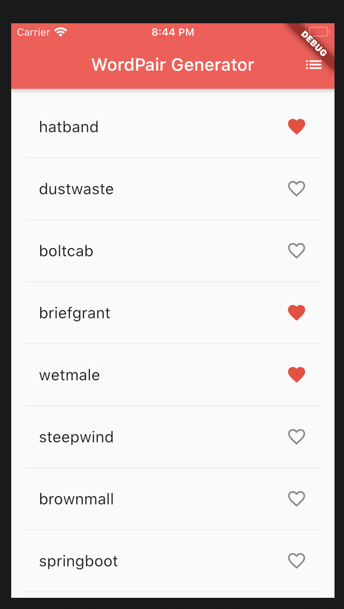
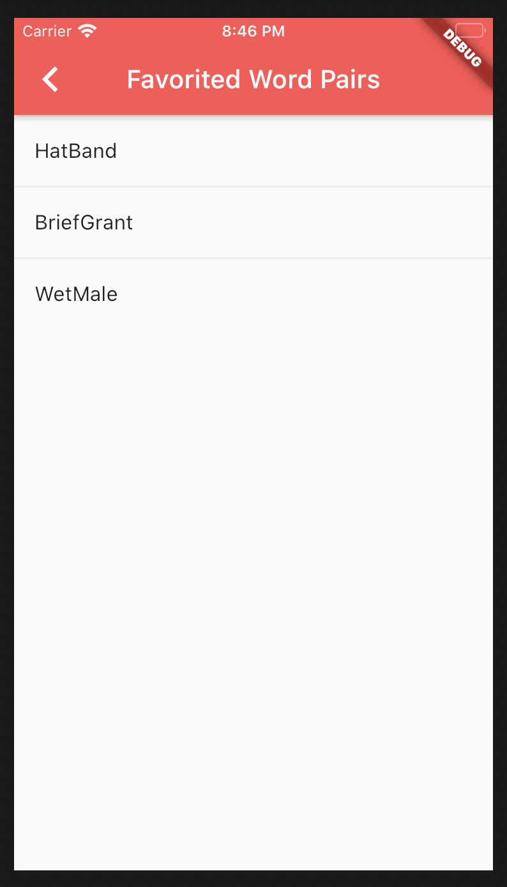

# first_flutter_app

Generates random sets of word pairs from the English Words Dart API (https://pub.dev/packages/english_words) and displays them in a list view. Can click on words to add or remove them from a favorites list.

